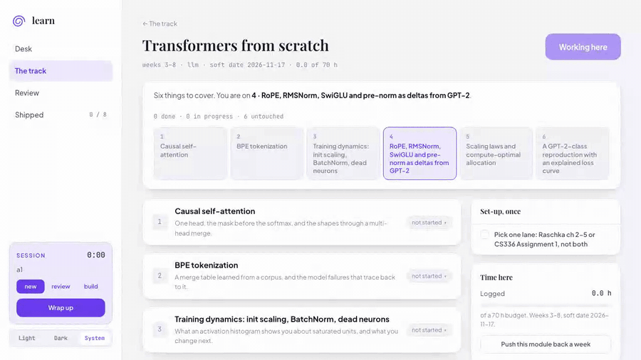
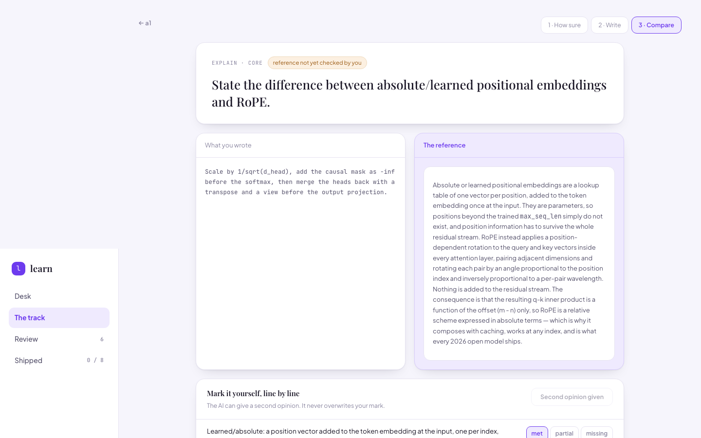
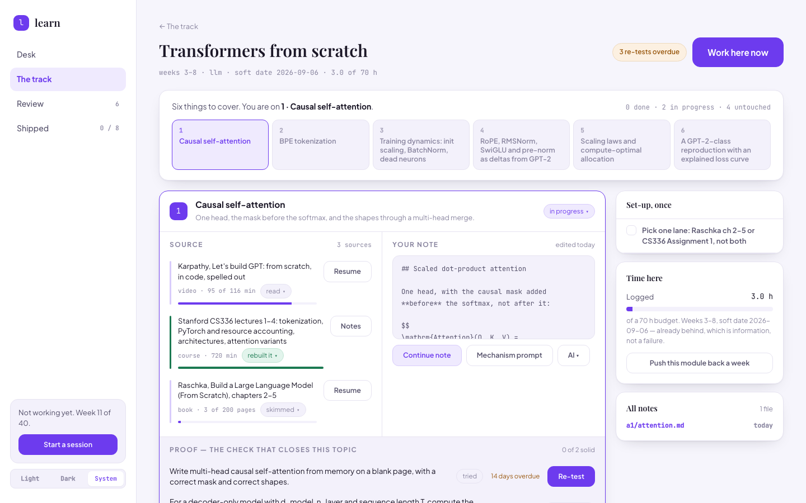

[](https://github.com/Ihjas-tk/personal-lms/actions/workflows/ci.yml)
[](LICENSE)
[](https://www.python.org/)

# learn — a self-hosted study tracker that measures whether you actually know it

**An eval harness for the learner.** Point it at any curriculum: every *"done when you can…"*
line becomes a typed self-test with the reference hidden until you freeze your answer.
Confidence first, calibration after. Active recall and a spaced re-test ladder over Markdown
and YAML in a git repo you own — self-hosted, local-first, single-user: FastAPI and React on
localhost, no account, no streaks.

**[Quick start](#quick-start)** · **[Why no streaks](#no-streaks-no-points-no-badges)** · [Write a track](docs/curriculum-schema.md) · [Compared to Anki](#compared-to-anki-obsidian-spaced-repetition-logseq-remnote)



## Quick start

```bash
git clone https://github.com/Ihjas-tk/personal-lms && cd personal-lms/learn
uv sync                                      # deps and the `learn` command
(cd web && npm install && npm run build)     # the UI — required, see below
uv run learn init --track ../tracks/starter/track.yaml
uv run learn                                 # http://127.0.0.1:8765
```

From the repo root:

```bash
docker compose run --rm learn learn init --track /app/tracks/starter/track.yaml
docker compose up -d      # same address; ./vault is bind-mounted
```

The Node build is **required on a fresh clone**: the server serves the UI from the
git-ignored `learn/src/learn/static`. Without it every page 404s.

## How it works

**1 · Point it at a curriculum.** A track is one YAML file — areas, phases, modules, topics,
resources, artefacts — with a **Check** behind every *done when you can…* line.

**2 · Read where the source is.** A module is one page, a syllabus of topics. **Focus mode**
puts the video left, the note right, a jot line underneath.

**3 · Say how sure you are, then answer from memory.** The confidence slider cannot be
skipped; paste and autocomplete are off for code checks. **Submit and freeze** ends it.



**4 · Freezing reveals the reference.** Not a toggle — it is not sent to the browser until the
answer is stamped. You mark the rubric yourself, against the confidence you gave before you
knew: *you said 90%, you were right 62% of the time.*

**5 · Then it comes back.** Re-tests at 2, 7, 21 and 60 days, sooner if you missed one you
were sure of. **`lasting`** takes two clean passes seven days apart — requalification, not a
score you keep. Mistakes go to an append-only error ledger.



## No streaks, no points, no badges

No percent-complete bar, no "mark as complete". Counted: core checks at **solid** or
**lasting**, and artefacts that exist.

A design choice, not a health claim. **A streak measures attendance; this app is trying to
measure knowledge.** The evidence does not say streaks harm you — a large randomised trial
found they *raised* engagement, with no discouragement effect
([Aulagnon et al., 2026](https://www.ipr.northwestern.edu/documents/working-papers/2026/wp-26-05.pdf)).
They measure the wrong thing here.

What replaced them is better evidenced. Practice testing is one of two techniques rated
high-utility in a review of ten ([Dunlosky et al., 2013](https://journals.sagepub.com/doi/abs/10.1177/1529100612453266)),
and its advantage is *delayed*: restudy wins after five minutes, loses badly after a week
([Roediger & Karpicke, 2006](https://pubmed.ncbi.nlm.nih.gov/16507066/)). Hence the ladder and
no checkbox — a checkbox records a judgment of learning, not learning. Nobody has evaluated
this app; the design follows the literature and claims nothing.

## Your data

```
vault/                             a git repo, made on first run
  track.yaml  plan.yaml            curriculum, dates, weekly budget
  errors.jsonl  ai-log.jsonl       append-only ledgers
  modules/<id>/notes/<topic>.md    one note per topic
  modules/<id>/attempts/*.md       one per attempt, answer frozen
  sessions/*.md                    reflection, the next if-then plan
```

```yaml
check_id: rag-eval-golden-set
confidence_pre: 70                 # taken before you saw anything
submitted: 2026-09-20T21:04:11
score: partial
category: conflated_two_things
```

`git log` is your history; the app commits at each session close. **No telemetry, no account.**
Two optional AI actions use your own `ANTHROPIC_API_KEY`; the rest needs none.
**Local-only, no auth by design — do not expose it to the internet.**

## Use it for any subject

Three tracks ship here: [`starter`](tracks/starter/track.yaml), a commented template with
every optional field in it; [`linear-algebra`](tracks/linear-algebra/track.yaml),
twelve weeks of 3Blue1Brown and Strang; and
[`llm-engineering-and-evals`](tracks/llm-engineering-and-evals/), the forty-week flagship.
Copy the starter, then `uv run learn check my-subject/track.yaml`: it prints
`field.path: what is wrong`, one line per error, not a traceback. Set `debrief_day: Saturday`
and the weekly debrief renames itself. Fields:
[`docs/curriculum-schema.md`](docs/curriculum-schema.md).

## Compared to Anki, Obsidian Spaced Repetition, Logseq, RemNote

| Project | What it is | Where `learn` differs |
| --- | --- | --- |
| [Anki](https://github.com/ankitects/anki) | Atomic-fact SRS: FSRS, mobile, shared decks | Anki tests recognition, self-graded off a revealed card. `learn` tests *skills* — "derive X", "write Y" — typed, reference withheld until frozen. No mobile, no decks, a fixed ladder not FSRS. |
| [Obsidian Spaced Repetition](https://github.com/st3v3nmw/obsidian-spaced-repetition) | Reviews notes you wrote | Nearest in mechanism. No typed answer, hidden reference, calibration. |
| [Logseq](https://github.com/logseq/logseq) | PKM, flashcards built in | Captures and links. No assessment model: no rubric, confidence, ladder. |
| [RemNote](https://www.remnote.com/) | Notes plus flashcards, hosted | Closed, cloud, subscription. `learn` is MIT, offline. |
| [SilverBullet](https://github.com/silverbulletmd/silverbullet) | Markdown-vault platform, MIT | Closest architectural analogue; a notes platform, not assessment. |

## Roadmap

- **FSRS scheduling**, beside the fixed ladder.
- **An Ollama adapter**, so AI actions need no hosted key.
- **Spoken explain-back**, transcribed and graded against the rubric.
- **A concept graph** built from the curriculum, not backlinks.
- **Curriculum import from Markdown**: a syllabus you wrote becomes a track.

## Contributing

[CONTRIBUTING.md](CONTRIBUTING.md) has the setup, the tests and the design constraints a PR
must respect. Open an issue before a big one. Operator manual:
[`learn/README.md`](learn/README.md).

## License

[MIT](LICENSE). Code of conduct: [Contributor Covenant 3.0](CODE_OF_CONDUCT.md).
